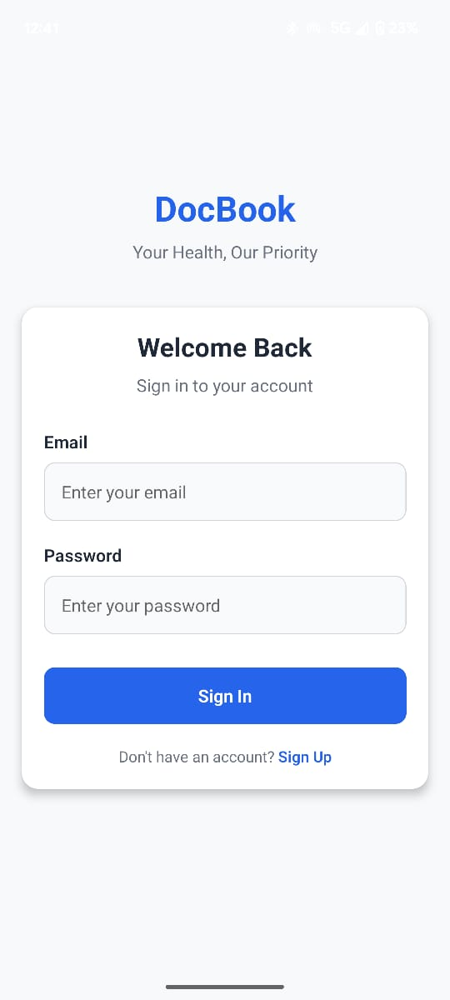
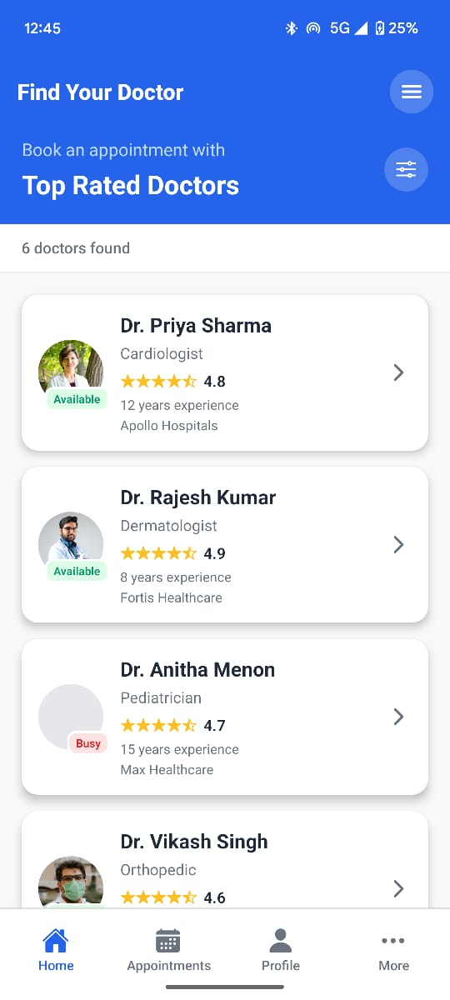
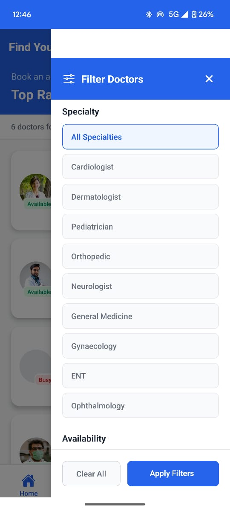
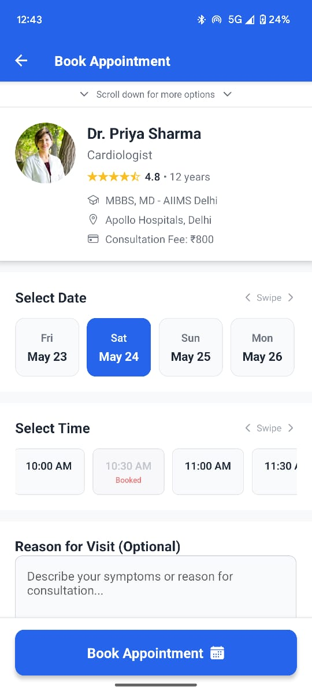
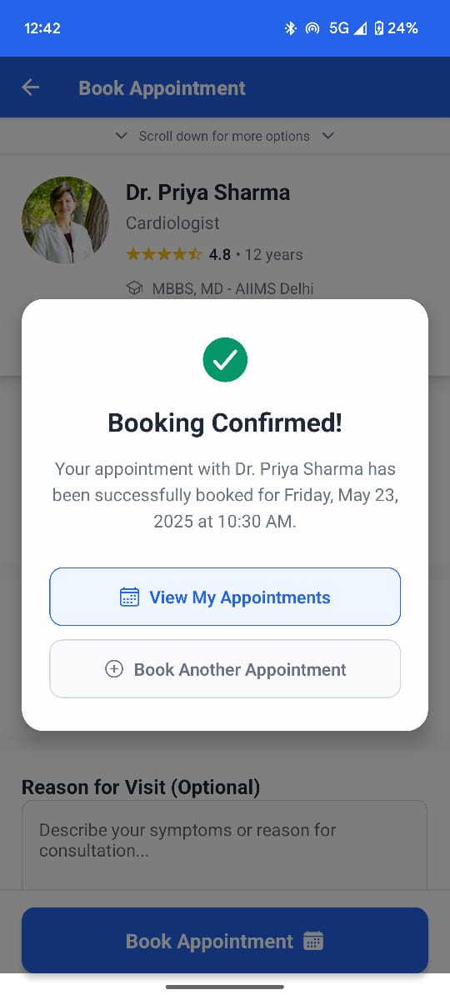
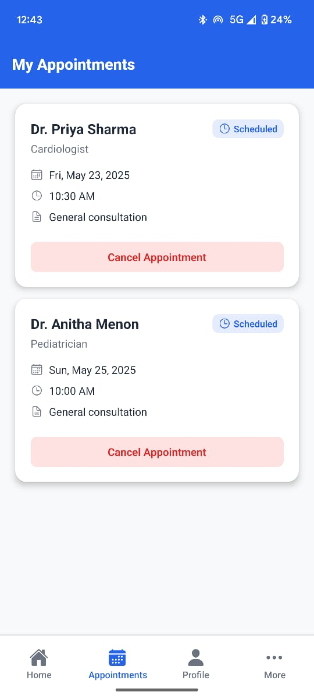
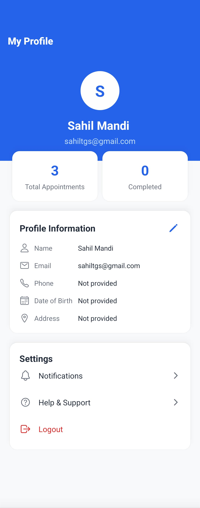
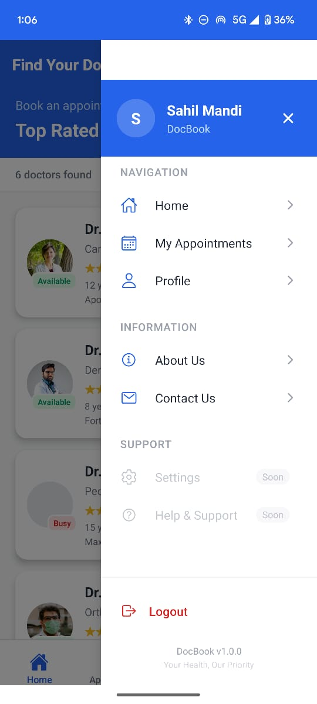
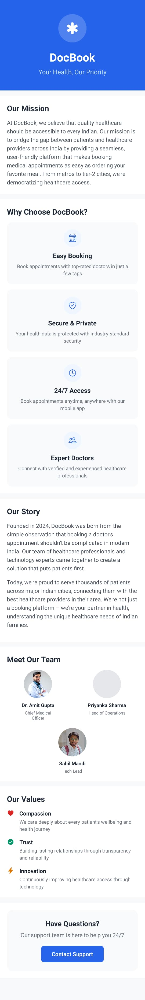

# DocBook - Doctor Appointment Booking App

**Your Health, Our Priority**

DocBook is a comprehensive React Native mobile application that simplifies the process of booking medical appointments in India. Built with modern UI/UX principles and localized for the Indian healthcare market, DocBook bridges the gap between patients and healthcare providers.

## Features

### Core Functionality
- **Authentication System** - Secure login/signup with form validation
- **Doctor Discovery** - Browse top-rated doctors with detailed profiles
- **Smart Booking** - Intuitive date and time slot selection
- **Appointment Management** - View, track, and cancel appointments
- **User Profile** - Editable profile with appointment statistics
- **Information Pages** - About us and contact support

### Advanced Features
- **Filtering** - Filter doctors by specialty, availability, rating, experience, and location
- **Local State Management via Hooks** - Real-time slot availability with visual indicators
- **Multiple Navigation Patterns** - Bottom tabs, drawer navigation, and stack navigation
- **Data Persistence** - AsyncStorage for offline data management
- **Modern UI/UX** - Clean design with smooth animations and transitions

## 🛠️ Tech Stack

- **Framework:** React Native with Expo
- **Navigation:** Expo Router (File-based routing)
- **State Management:** React Hooks + AsyncStorage
- **UI Components:** React Native + Expo Vector Icons
- **Language:** TypeScript
- **Storage:** AsyncStorage for local data persistence

## 📦 Installation & Setup

### Prerequisites
- Node.js (LTS version)
- npm or yarn
- Expo CLI
- Android Studio (for Android development) or Xcode (for iOS development)

### Getting Started

1. **Clone the repository**
   ```bash
   git clone https://github.com/yourusername/docbook-app.git
   cd docbook-app
   ```

2. **Install dependencies**
   ```bash
   npm install
   # or
   yarn install
   ```

3. **Install Expo CLI (if not already installed)**
   ```bash
   npm install -g @expo/cli
   ```

4. **Start the development server**
   ```bash
   npx expo start
   ```

5. **Run on device/emulator**
   - **Android:** Press `a` or scan QR code with Expo Go app
   - **iOS:** Press `i` or scan QR code with Camera app
   - **Web:** Press `w` to open in browser

## App Screenshots

### Authentication & Home
| Login/Signup | Home Screen | Doctor Filters |
|:---:|:---:|:---:|
|  |  |  |

### Booking & Management
| Booking Screen | Appointment Details | My Appointments |
|:---:|:---:|:---:|
|  |  |  |

### Profile & Navigation
| User Profile | Drawer Navigation | About Us |
|:---:|:---:|:---:|
|  |  | 
## Project Structure

```
DocBook/
├── app/                          # Expo Router pages
│   ├── (tabs)/                   # Tab navigation group
│   │   ├── _layout.tsx          # Tab layout configuration
│   │   ├── index.tsx            # Home screen (doctor listings)
│   │   ├── appointments.tsx     # User appointments
│   │   ├── profile.tsx          # User profile
│   │   └── more.tsx             # More options
│   ├── booking/
│   │   └── [doctorId].tsx       # Dynamic booking screen
│   ├── _layout.tsx              # Root layout
│   ├── index.tsx                # Root redirect
│   ├── auth.tsx                 # Authentication screen
│   ├── logout.tsx               # Logout handler
│   ├── about.tsx                # About us page
│   ├── contact.tsx              # Contact us page
│   └── +not-found.tsx           # 404 screen
├── components/                   # Reusable components
│   ├── CustomDrawer.tsx         # Navigation drawer
│   ├── FilterDrawer.tsx         # Doctor filtering
│   ├── LoadingOverlay.tsx       # Loading component
│   └── ErrorBoundary.tsx        # Error handling
├── assets/                       # Static assets
└── package.json
```

## Key Features Implemented

### 1. **Authentication Flow**
- Toggle between login/signup modes
- Form validation (email format, password strength)
- AsyncStorage for session persistence
- Automatic navigation on authentication state changes

### 2. **Doctor Discovery & Filtering**
- Comprehensive doctor profiles with ratings and availability
- Advanced filtering system with multiple criteria
- Real-time filter results with active filter indicators
- Indian healthcare provider localization

### 3. **Smart Booking System**
- Date selection with next 7 days availability
- Time slot selection with horizontal scrolling
- Double booking prevention with visual slot indicators
- Optional reason for visit input
- Success confirmation with navigation options

### 4. **Appointment Management**
- Comprehensive appointment listing with status indicators
- Cancel appointment functionality with confirmation
- Pull-to-refresh capability
- Empty state handling

### 5. **User Profile & Settings**
- Editable user information with modal interface
- Appointment statistics display
- Secure logout with data clearing
- Avatar generation from user initials

## Navigation Architecture

The app implements a sophisticated navigation system:

- **Stack Navigation (Root):** Handles authentication flow and main app screens
- **Tab Navigation:** Persistent bottom navigation for core features
- **Drawer Navigation:** Slide-out menu accessible from hamburger icon
- **Modal Navigation:** For forms, filters, and detailed views


## Challenges Overcome

### 1. **Complex Navigation Architecture**
**Challenge:** Implementing multiple navigation patterns (stack, tabs, drawer) that work seamlessly together.
**Solution:** Used Expo Router's file-based routing with proper layout nesting and state management across navigators.

### 2. **State Management Across Screens**
**Challenge:** Maintaining consistent state for appointments, filters, and user data across multiple screens.
**Solution:** Implemented AsyncStorage for persistence with React hooks for real-time state updates and proper data synchronization.

### 3. **Real-time Booking Conflict Prevention**
**Challenge:** Preventing users from booking the same time slot multiple times.
**Solution:** Created a dynamic slot availability system that checks existing appointments in real-time and provides visual feedback.

### 4. **Authentication Flow & Data Persistence**
**Challenge:** Creating a smooth authentication experience with proper logout handling.
**Solution:** Implemented a dedicated logout route and auth state checking to ensure proper navigation flow.

### 5. **Advanced Filtering System**
**Challenge:** Building a comprehensive filter system with multiple criteria and real-time updates.
**Solution:** Created a reusable FilterDrawer component with state management that updates the main doctor list dynamically.

## Design Decisions

- **Color Scheme:** Primary blue (#2563eb) for trust and professionalism
- **Typography:** Clear hierarchy with appropriate font sizes for accessibility
- **Component Design:** Card-based layout for easy scanning and interaction
- **Responsive Design:** Safe area handling for different device sizes
- **User Feedback:** Loading states, success animations, and error handling

## Future Enhancements

- **Multi-language Support:** Hindi and regional language translations
- **Payment Integration:** UPI, card payments, and insurance integration
- **Telemedicine:** Video consultation capabilities
- **Push Notifications:** Appointment reminders and updates
- **Location Services:** GPS-based doctor discovery
- **Review System:** Patient reviews and ratings
- **Health Records:** Medical history and prescription management


